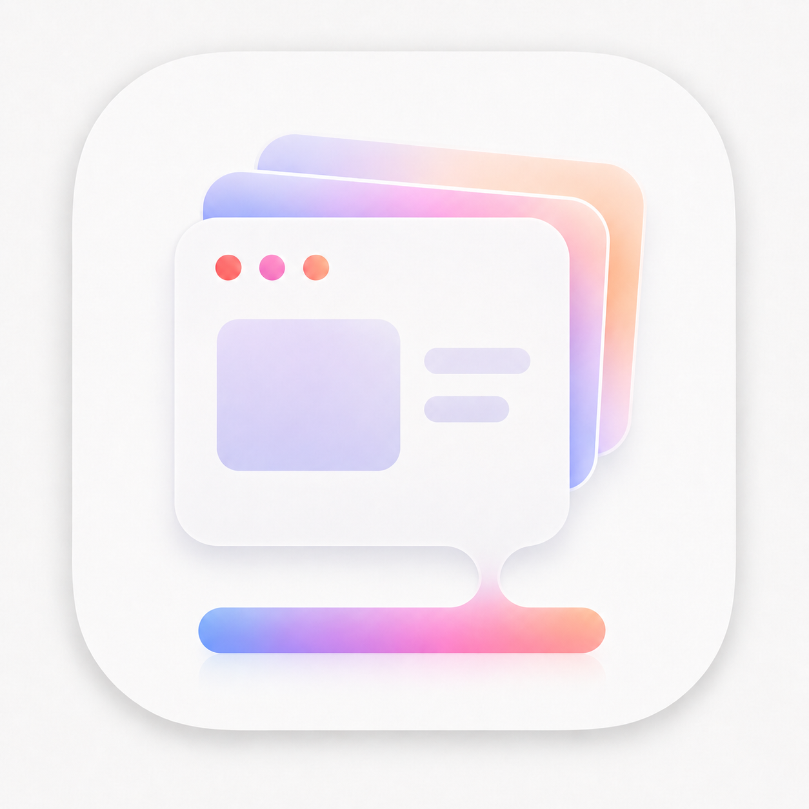

<p align="center">
  
</p>

<h1 align="center">DockWindowPreview</h1>

<p align="center">
  <strong>让 macOS Dock 拥有接近 Windows 任务栏的窗口预览体验。</strong>
</p>

<p align="center">
  鼠标悬停 Dock 图标，即刻查看该 App 的所有窗口。点击缩略图切换窗口，hover 卡片可快速关闭、最小化或退出所属 App。
</p>

<p align="center">
  <a href="https://github.com/Rainchen537/DockWindowPreview/releases/tag/v0.4.3">
    
  </a>
  
  
  
  
</p>

<p align="center">
  <a href="https://github.com/Rainchen537/DockWindowPreview/releases/download/v0.4.3/DockWindowPreview-v0.4.3.dmg">
    
  </a>
</p>

<p align="center">
  
</p>

## ✨ 主要功能

| 功能 | 体验 |
| --- | --- |
| 🪟 Dock 悬浮预览 | 鼠标停在 Dock 中某个 App 图标上，弹出该 App 的窗口预览面板。 |
| ⚡ 快速切换窗口 | 点击任意缩略图，直接激活 App 并聚焦对应窗口。 |
| 💤 唤回最小化窗口 | 被最小化的窗口也会出现在预览里，点击后自动恢复并置前。 |
| 🎚 卡片窗口控制 | hover 某个窗口卡片，左上角显示退出 App、关闭窗口、最小化窗口三颗控制按钮。 |
| 🎯 临时聚焦预览 | hover 卡片超过 `50ms` 后，用轻量覆盖层突出当前窗口快照，不改变真实桌面状态。 |
| 🎛 设置面板 | 可调整悬停延迟、缩略图高度、标题显示、开机启动和调试日志。 |
| 🔐 公开 API 实现 | 使用 AppKit、Accessibility、CoreGraphics，不依赖 macOS 私有 API。 |

## 📦 安装

1. 下载最新版 DMG：  
   [DockWindowPreview-v0.4.3.dmg](https://github.com/Rainchen537/DockWindowPreview/releases/download/v0.4.3/DockWindowPreview-v0.4.3.dmg)
2. 打开 DMG。
3. 将 `DockWindowPreview.app` 拖到 `Applications`。
4. 启动 `DockWindowPreview`，按提示开启权限。

> 当前版本已使用 Developer ID 签名，但还没有 notarization。首次打开时如果 macOS 提示无法验证，请在 Finder 中右键 App，选择 **Open / 打开**。

## 🔑 权限说明

DockWindowPreview 需要两项系统权限，都是为了实现窗口预览和窗口切换：

| 权限 | 用途 |
| --- | --- |
| Accessibility / 辅助功能 | 读取 Dock 的 Accessibility 元素、匹配窗口、恢复最小化窗口、raise/focus 指定窗口。 |
| Screen & System Audio Recording / 屏幕与系统音频录制 | 使用 CoreGraphics 生成其他 App 的窗口缩略图。 |

授权路径：

```text
System Settings
→ Privacy & Security
→ Accessibility

System Settings
→ Privacy & Security
→ Screen & System Audio Recording
```

开启屏幕录制权限后，通常需要重启 App 才会生效。

## 🧭 使用方式

1. 启动 DockWindowPreview。
2. 将鼠标移动到 Dock 中正在运行的 App 图标上。
3. 等待约 `100ms`，预览面板会自动弹出。
4. 点击缩略图切换到对应窗口。
5. hover 某张卡片，左上角可退出所属 App、关闭窗口或最小化窗口。

## ⚙️ 设置

点击菜单栏图标或 Dock 图标可打开设置。

可调整：

- `悬停延迟`：默认 `100ms`。
- `缩略图高度`：窗口宽度会按原始比例自适应。
- `显示窗口标题`：控制预览卡片顶部标题栏。
- `开机启动`：使用 macOS 官方 `SMAppService.mainApp`。
- `调试日志`：输出 `[DockWindowPreview]` 前缀日志。

## 🛠 技术栈

```text
Swift
AppKit
Accessibility API / AXUIElement
CoreGraphics / CGWindowListCopyWindowInfo / CGWindowListCreateImage
NSPanel / NSStatusItem / NSWorkspace
ServiceManagement / SMAppService
```

## 🧑‍💻 从源码构建

```sh
git clone https://github.com/Rainchen537/DockWindowPreview.git
cd DockWindowPreview
open DockWindowPreview.xcodeproj
```

命令行构建：

```sh
xcodebuild -project DockWindowPreview.xcodeproj \
  -scheme DockWindowPreview \
  -configuration Release \
  build
```

## 🚧 已知限制

macOS 没有公开的 Dock hover API，也没有公开 API 可以从 Dock 图标直接得到 bundle identifier。DockWindowPreview 通过 Dock.app 的 Accessibility hit-test 读取 `AXTitle` / `AXDescription`，再 best-effort 映射到正在运行的 App。

公开 Accessibility API 也不稳定暴露 `CGWindowID`。窗口激活使用标题、位置、尺寸等信息匹配 AXWindow，再执行 `AXRaise`、`AXMain` 和 `AXFocused`。

最小化窗口无法通过公开 CoreGraphics API 截取实时缩略图，所以会显示“已最小化”占位图。点击后会通过 `AXMinimized = false` 尝试恢复窗口。

hover 卡片时的“只看当前窗口”效果是公开 API 下的视觉模拟：App 会覆盖一层半透明面板并绘制当前窗口截图，不会真的隐藏其它窗口。

全屏 Space、Stage Manager、多显示器、Dock 自动隐藏和 Dock 放大可能影响命中测试和面板定位。

## 🗺 后续计划

- 更稳定的 Dock 图标命中缓存。
- 多屏幕坐标修正。
- 更漂亮的动效和 hover 过渡。
- 自动更新。
- Apple notarization。
