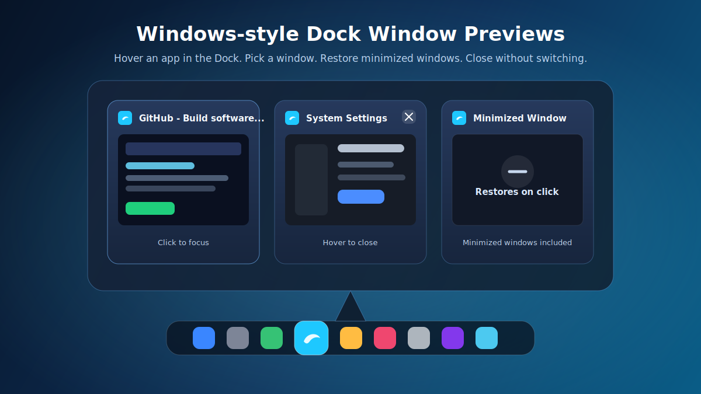

<p align="center">
  
</p>

<h1 align="center">Y-Dock</h1>

<p align="center">
  <strong>让 macOS Dock 拥有接近 Windows 任务栏的窗口预览体验。</strong>
</p>

<p align="center">
  鼠标悬停 Dock 图标，即刻查看该 App 的所有窗口；也可以按住 Option+Tab，用 Windows Alt+Tab 的方式快速切换窗口，按 Esc 随时取消。
</p>

<p align="center">
  <a href="https://github.com/Rainchen537/Y-Dock/releases/tag/v1.1.11">
    
  </a>
  
  
  
  
</p>

<p align="center">
  <a href="https://github.com/Rainchen537/Y-Dock/releases/download/v1.1.11/Y-Dock-v1.1.11.dmg">
    
  </a>
</p>

<p align="center">
  
</p>

## ✨ 主要功能

| 功能 | 体验 |
| --- | --- |
| 🪟 Dock 悬浮预览 | 鼠标停在 Dock 中某个 App 图标上，弹出该 App 的窗口预览面板。 |
| 🧩 Dock 拼接式卡片 | Dock 悬浮预览去掉外层矩形容器，多窗口像 Windows 任务栏一样合并成一组。 |
| ⚡ 快速切换窗口 | 点击任意缩略图，直接激活 App 并聚焦对应窗口。 |
| ⌥ Option+Tab 切换 | 按住 `Option` 后按 `Tab` 呼出亚克力窗口切换器，严格按最近聚焦顺序排列并从第一张开始选择，按 `Esc` 取消。 |
| 🚀 异步缩略图 | 首屏先显示轻量卡片，缩略图后台补齐，减少热键和 Dock 横扫卡顿。 |
| 💤 唤回最小化窗口 | 被最小化的窗口也会出现在预览里，点击后自动恢复并置前。 |
| 🎚 卡片窗口控制 | hover 某个窗口卡片，左上角显示退出 App、关闭窗口、最小化窗口三颗控制按钮。 |
| 🎯 临时聚焦预览 | hover 卡片超过 `50ms` 后，用轻量覆盖层突出当前窗口快照，不改变真实桌面状态。 |
| 🎛 设置窗口 | 独立设置窗口采用左侧栏和右侧内容区，可调整悬停延迟、缩略图高度、标题显示、开机启动和调试日志。 |
| ⬇️ 直接更新 | 检测到新版本后可直接下载、替换并重启，不需要手动拖拽 DMG。 |
| 🔐 公开 API 实现 | 使用 AppKit、Accessibility、CoreGraphics，不依赖 macOS 私有 API。 |

## 📦 安装

1. 下载最新版 DMG：  
   [Y-Dock-v1.1.11.dmg](https://github.com/Rainchen537/Y-Dock/releases/download/v1.1.11/Y-Dock-v1.1.11.dmg)
2. 打开 DMG。
3. 将 `Y-Dock.app` 拖到 `Applications`。
4. 启动 `Y-Dock`，按提示开启权限。

> 当前版本已使用 Developer ID 签名并通过 Apple notarization，首次打开不需要绕过 Gatekeeper。

## 🔑 权限说明

Y-Dock 需要两项系统权限，都是为了实现窗口预览和窗口切换：

| 权限 | 用途 |
| --- | --- |
| Accessibility / 辅助功能 | 读取 Dock 的 Accessibility 元素、匹配窗口、恢复最小化窗口、raise/focus 指定窗口。 |
| Screen & System Audio Recording / 屏幕与系统音频录制 | 使用 CoreGraphics 生成其他 App 的窗口缩略图。 |

授权路径：

```text
System Settings
→ Privacy & Security
→ Accessibility

System Settings
→ Privacy & Security
→ Screen & System Audio Recording
```

开启屏幕录制权限后，通常需要重启 App 才会生效。

## 🧭 使用方式

1. 启动 Y-Dock。
2. 将鼠标移动到 Dock 中正在运行的 App 图标上。
3. 等待约 `100ms`，预览面板会自动弹出。
4. 点击缩略图切换到对应窗口。
5. hover 某张卡片，左上角可退出所属 App、关闭窗口或最小化窗口。
6. 也可以按住 `Option` 并按 `Tab` 打开窗口切换器；首次呼出选中 MRU 列表的第一张，继续按 `Tab` 循环，松开 `Option` 后切到当前选中的窗口，按 `Esc` 可取消。

## ⚙️ 设置

点击菜单栏图标可打开设置。Y-Dock 是后台菜单栏工具，默认不会显示在 Dock 或 Cmd-Tab 中。

可调整：

- `悬停延迟`：默认 `100ms`。
- `缩略图高度`：默认 `165px`，窗口宽度会按原始比例自适应。
- `显示窗口标题`：控制预览卡片顶部标题栏。
- `开机启动`：使用 macOS 官方 `SMAppService.mainApp`。
- `窗口切换`：显示全局快捷键 `Option+Tab`。
- `调试日志`：输出 `[Y-Dock]` 前缀日志。

## 🛠 技术栈

```text
Swift
AppKit
Accessibility API / AXUIElement
CoreGraphics / CGWindowListCopyWindowInfo / CGWindowListCreateImage
NSPanel / NSStatusItem / NSWorkspace
Carbon / RegisterEventHotKey
ServiceManagement / SMAppService
```

## 🧑‍💻 从源码构建

GitHub 仓库：[Rainchen537/Y-Dock](https://github.com/Rainchen537/Y-Dock)

```sh
git clone https://github.com/Rainchen537/Y-Dock.git
cd Y-Dock
open DockWindowPreview.xcodeproj
```

命令行构建：

```sh
xcodebuild -project DockWindowPreview.xcodeproj \
  -scheme DockWindowPreview \
  -configuration Release \
  build
```

## 🧾 更新日志

完整更新记录见 [CHANGELOG.md](CHANGELOG.md)。

## 🚧 已知限制

macOS 没有公开的 Dock hover API，也没有公开 API 可以从 Dock 图标直接得到 bundle identifier。Y-Dock 通过 Dock.app 的 Accessibility hit-test 读取 `AXTitle` / `AXDescription`，再 best-effort 映射到正在运行的 App。

公开 Accessibility API 也不稳定暴露 `CGWindowID`。窗口激活使用标题、位置、尺寸等信息匹配 AXWindow，再执行 `AXRaise`、`AXMain` 和 `AXFocused`。

最小化窗口无法通过公开 CoreGraphics API 截取实时缩略图，所以会显示“已最小化”占位图。点击后会通过 `AXMinimized = false` 尝试恢复窗口。

hover 卡片时的“只看当前窗口”效果是公开 API 下的视觉模拟：App 会覆盖一层半透明面板并绘制当前窗口截图，不会真的隐藏其它窗口。

`Option+Tab` 通过公开 Carbon HotKey API 注册全局快捷键，并用公开事件监听支持 `Esc` 取消。窗口聚焦仍依赖 Accessibility；如果缺少辅助功能权限，可能只能激活 App，无法稳定聚焦到精确窗口。

全屏 Space、Stage Manager、多显示器、Dock 自动隐藏和 Dock 放大可能影响命中测试和面板定位。

## 🗺 后续计划

- 更稳定的 Dock 图标命中缓存。
- 多屏幕坐标修正。
- 更漂亮的动效和 hover 过渡。
- 自动更新。
